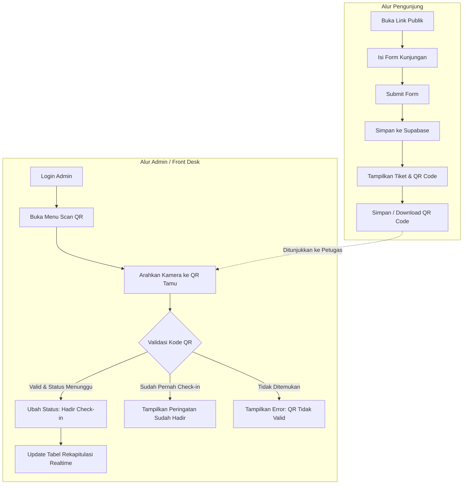

# Product Requirements Document (PRD)
## Sistem Manajemen Kunjungan Pegawai (Web Kunjungan Simpel)

---

## 1. Ringkasan Eksekutif (Executive Summary)

### 1.1 Latar Belakang & Masalah
Pencatatan tamu atau pengunjung yang datang ke kantor/instansi seringkali masih menggunakan buku tamu manual berbahan kertas. Cara ini memiliki banyak kelemahan:
- Data sulit dicari dan direkap secara real-time.
- Risiko tulisan tangan tidak terbaca atau buku tamu rusak/hilang.
- Proses verifikasi kedatangan di front desk lambat.
- Tidak ada validasi instan atas data kunjungan.

### 1.2 Solusi
**Sistem Kunjungan Pegawai Simpel** adalah aplikasi web modern berbasis cloud yang memfasilitasi pra-registrasi atau pendaftaran kedatangan tamu secara mandiri oleh pengunjung, menghasilkan tiket digital berbasis **QR Code**, serta menyediakan portal **Admin (Front Desk/Resepsionis)** untuk melakukan pemindaian (scanning), verifikasi validitas tiket, dan rekapitulasi data pengunjung secara otomatis.

### 1.3 Tujuan & Manfaat
- **Simpel & Cepat**: Pengunjung cukup mengisi form singkat tanpa perlu registrasi akun/login.
- **Verifikasi Real-time**: Admin memverifikasi kedatangan hanya dengan scan QR Code menggunakan kamera ponsel/laptop.
- **Rekap Otomatis**: Data tersimpan rapi di database cloud, mudah difilter berdasarkan tanggal/status dan diekspor.
- **User-Friendly**: Desain responsif, clean, dan intuitif baik di layar smartphone maupun desktop.

---

## 2. Tech Stack & Arsitektur Sistem

Sistem dibangun menggunakan ekosistem teknologi modern terbaru yang efisien, cepat, dan scalable:

| Komponen | Teknologi | Keterangan & Alasan Pemilihan |
| :--- | :--- | :--- |
| **Framework Utama** | **Next.js (App Router)** | Versi terbaru (React Server Components, Server Actions, performa cepat & SEO-friendly). |
| **Styling & Design** | **Tailwind CSS** | Utility-first CSS untuk styling kustom yang fleksibel, cepat, dan modern. |
| **Komponen UI** | **shadcn/ui** | Komponen UI berbasis Radix UI yang accessible, clean, modular, dan mudah dikustomisasi. |
| **Database & Auth** | **Supabase (PostgreSQL)** | Layanan BaaS lengkap: database PostgreSQL, Row Level Security (RLS), dan Supabase Auth untuk Admin. |
| **Icon Pack** | **Lucide React** | Ikon modern dan konsisten. |
| **Form Management** | **React Hook Form + Zod** | Validasi skema formulir tipe-aman (type-safe) di sisi klien & server. |
| **QR Code Generator** | `qrcode.react` / `qrcode` | Men-generate QR Code dinamis berbasis teks/kode unik kunjungan. |
| **QR Code Scanner** | `html5-qrcode` / `@zxing/browser` | Scanner kamera browser yang ringan dan mendukung kamera smartphone & webcam. |
| **Notifikasi / Feedback** | **Sonner** (shadcn toast) | Toast notification modern dan elegan untuk feedback aksi pengguna. |

---

## 3. Peran Pengguna (User Roles) & Hak Akses

| Peran | Deskripsi | Hak Akses Utama |
| :--- | :--- | :--- |
| **Pengunjung (Public / Guest)** | Tamu yang berkunjung ke kantor/pegawai | - Mengakses link publik pendaftaran kunjungan.<br>- Mengisi data formulir kunjungan.<br>- Menerima tiket digital beserta QR Code unik.<br>- Mengunduh / menyimpan tiket QR Code. |
| **Admin / Resepsionis (Front Desk)** | Petugas yang bertugas menerima tamu di lobi | - Login akun admin (Supabase Auth).<br>- Melihat statistik dan rekapitulasi semua kunjungan.<br>- Menggunakan fitur QR Scanner untuk verifikasi check-in.<br>- Melakukan check-in/check-out manual bila diperlukan.<br>- Memfilter, mencari data, dan mengekspor data kunjungan (CSV/Excel). |

---

## 4. Fitur Utama & Kebutuhan Fungsional (Functional Requirements)

### 4.1 Halaman Publik (Public Portal)

#### A. Formulir Pendaftaran Kunjungan (`/` atau `/kunjungan`)
- **Akses**: Terbuka untuk umum tanpa perlu login.
- **Input Data Pengunjung**:
  1. **Nama Lengkap**: Wajib diisi (string).
  2. **Nomor WhatsApp / Telepon**: Wajib diisi (format nomor telepon Indonesia valid).
  3. **Instansi / Lembaga / Perusahaan**: Wajib diisi (contoh: "PT ABC", "Dinas Pendidikan", atau "Pribadi").
  4. **Pegawai yang Dituju**: Wajib diisi (pilihan dropdown atau autocomplete nama pegawai).
  5. **Divisi / Unit Kerja**: Otomatis terisi atau dapat dipilih sesuai pegawai tujuan.
  6. **Keperluan Kunjungan**: Wajib diisi (textarea deskripsi ringkas tujuan kedatangan).
  7. **Tanggal Kunjungan**: Wajib diisi (default: tanggal hari ini, dapat memilih tanggal yang akan datang).
  8. **Perkiraan Jam Kunjungan**: Wajib diisi (time picker).
  9. **Jumlah Tamu (Rombongan)**: Opsional (default: 1 orang).
- **Validasi Formulir**: Pengecekan input secara real-time sebelum submit (Zod schema).
- **Proses Submit**:
  - Menyimpan data ke Supabase dengan status awal: `'menunggu'` (Pending).
  - Menghasilkan **Kode Tiket Unik** otomatis (format contoh: `VIS-YYYYMMDD-XXXX` atau UUID v4).
  - Redirect otomatis ke halaman Tiket Digital Pengunjung.

#### B. Halaman Tiket Kunjungan Digital (`/tiket/[bookingCode]`)
- Menampilkan kartu tiket kunjungan dengan desain menarik dan formal.
- **Komponen Tiket**:
  - Kode Booking Kunjungan.
  - Tampilan **QR Code** unik yang berisi payload kode booking/URL verifikasi.
  - Ringkasan data (Nama Pengunjung, Instansi, Pegawai Tujuan, Tanggal, Jam, Keperluan).
  - Indikator Status: `Menunggu Kedatangan` (Kuning/Biru), `Sudah Hadir / Check-In` (Hijau), `Selesai` (Abu-abu).
- **Fitur Aksi Pengunjung**:
  - Tombol **"Download / Simpan Tiket"** (dapat diunduh sebagai gambar PNG/PDF atau tombol cetak browser).
  - Tombol **"Salin Link Tiket"** untuk akses kembali.
  - Instruksi ringkas: *"Tunjukkan QR Code ini kepada petugas resepsionis/satpam saat tiba di lokasi."*

---

### 4.2 Halaman Admin (Admin Portal)

#### A. Autentikasi Admin (`/admin/login`)
- Form login email & password aman menggunakan Supabase Auth.
- Proteksi route (`/admin/*`) menggunakan Next.js Middleware. Jika belum login, otomatis dialihkan ke halaman login.

#### B. Dashboard & Statistik Ringkas (`/admin`)
- Tampilan kartu metrik (KPI Cards):
  - **Total Pengunjung Hari Ini**
  - **Sedang Hadir / Aktif di Lokasi**
  - **Menunggu Kedatangan (Pending)**
  - **Selesai / Sudah Check-Out**
- Pintasan cepat ke tombol **"Scan QR Kunjungan"** dan **"Input Kunjungan Manual"**.

#### C. Fitur Pemindai QR Code (`/admin/scan`)
- Mengaktifkan kamera web/laptop atau kamera belakang smartphone.
- Dukungan switch kamera (Depan/Belakang) dan toggle flash/torch jika didukung perangkat.
- **Logika Verifikasi Scan**:
  1. Kamera mendeteksi QR Code dan mengekstrak kode booking unik.
  2. Sistem mencari data di database Supabase.
  3. **Kondisi 1: Kode Ditemukan & Status 'Menunggu'**
     - Memunculkan modal/bottom-sheet konfirmasi data pengunjung (Nama, Instansi, Pegawai Tujuan).
     - Menekan tombol konfirmasi atau otomatis mengubah status menjadi **`hadir` (Check-In)**.
     - Menyimpan waktu kedatangan (`checkin_at = NOW()`).
     - Menampilkan feedback visual sukses (alert hijau + nada bip sukses jika diaktifkan).
  4. **Kondisi 2: Kode Ditemukan tetapi Status Sudah 'Hadir'**
     - Menampilkan peringatan warna kuning: *"Pengunjung ini sudah melakukan check-in pada pukul HH:mm"*.
     - Menyediakan opsi untuk klik **"Check-Out / Selesai Kunjungan"**.
  5. **Kondisi 3: Kode Tidak Ditemukan / Tidak Valid**
     - Menampilkan peringatan warna merah: *"QR Code tidak terdaftar atau data kunjungan tidak ditemukan"*.

#### D. Rekapitulasi Data Kunjungan (`/admin/pengunjung`)
- **Tabel Data Lengkap**:
  - Kolom: Waktu Masuk, Kode Tiket, Nama Pengunjung, Kontak, Instansi, Pegawai Tujuan, Keperluan, Status, Aksi.
- **Fitur Filter & Pencarian**:
  - Search bar interaktif: Cari berdasarkan Nama, Instansi, atau Pegawai Tujuan.
  - Filter Tanggal: Hari ini, Minggu ini, Bulan ini, atau Custom Date Range.
  - Filter Status: Semua, Menunggu, Hadir, Selesai, Dibatalkan.
- **Aksi Cepat Baris Tabel**:
  - Lihat detail lengkap kunjungan.
  - Ubah status manual (contoh: bila kamera bermasalah, admin bisa cari nama dan klik "Tandai Hadir").
  - Ubah status ke "Selesai" (Check-out).
- **Fitur Ekspor**:
  - Ekspor data hasil filter ke format **Excel (.xlsx)** atau **CSV** untuk kebutuhan laporan bulanan/arsip instansi.

#### E. Manajemen Data Master Pegawai (`/admin/pegawai`) *(Pelengkap Rekomendasi)*
- Tabel daftar pegawai kantor (Nama, NIP/ID, Divisi/Bagian, Nomor Kontak internal).
- Form tambah/edit/hapus pegawai agar pilihan "Pegawai Tujuan" di form publik selalu mutakhir dan tidak salah ketik.

---

## 5. Skema Basis Data (Database Schema - Supabase PostgreSQL)

### 5.1 Tabel `kunjungan` (Visitors)
Menyimpan semua transaksi permohonan kunjungan dan status kedatangan.

```sql
-- Enum untuk status kunjungan
CREATE TYPE status_kunjungan AS ENUM ('menunggu', 'hadir', 'selesai', 'batal');

CREATE TABLE kunjungan (
  id UUID PRIMARY KEY DEFAULT gen_random_uuid(),
  booking_code VARCHAR(30) UNIQUE NOT NULL,
  nama_pengunjung VARCHAR(150) NOT NULL,
  no_kontak VARCHAR(25) NOT NULL,
  instansi VARCHAR(150) NOT NULL,
  pegawai_tujuan VARCHAR(150) NOT NULL,
  divisi_tujuan VARCHAR(100),
  keperluan TEXT NOT NULL,
  tanggal_kunjungan DATE NOT NULL DEFAULT CURRENT_DATE,
  jam_rencana TIME WITHOUT TIME ZONE,
  jumlah_tamu INT DEFAULT 1,
  status status_kunjungan DEFAULT 'menunggu',
  checkin_at TIMESTAMPTZ,
  checkout_at TIMESTAMPTZ,
  catatan_admin TEXT,
  created_at TIMESTAMPTZ DEFAULT NOW(),
  updated_at TIMESTAMPTZ DEFAULT NOW()
);

-- Index untuk mempercepat pencarian
CREATE INDEX idx_kunjungan_booking_code ON kunjungan (booking_code);
CREATE INDEX idx_kunjungan_tanggal ON kunjungan (tanggal_kunjungan);
CREATE INDEX idx_kunjungan_status ON kunjungan (status);
```

### 5.2 Tabel `pegawai` (Employees Master Data - Opsional tapi Disarankan)
Menyimpan daftar pegawai kantor untuk referensi dropdown form.

```sql
CREATE TABLE pegawai (
  id UUID PRIMARY KEY DEFAULT gen_random_uuid(),
  nama VARCHAR(150) NOT NULL,
  nip VARCHAR(50),
  jabatan VARCHAR(100),
  divisi VARCHAR(100) NOT NULL,
  is_active BOOLEAN DEFAULT TRUE,
  created_at TIMESTAMPTZ DEFAULT NOW()
);
```

### 5.3 Keamanan & Row Level Security (RLS)
- **Tabel `kunjungan`**:
  - `INSERT` (Anon): Diizinkan untuk semua pengunjung publik tanpa login.
  - `SELECT` (Anon): Hanya diizinkan jika mencocokkan `booking_code` (misal untuk melihat halaman tiket miliknya).
  - `ALL` (Authenticated Admin): Akses penuh (SELECT, UPDATE status, DELETE) untuk user yang telah terotentikasi.
- **Tabel `pegawai`**:
  - `SELECT` (Anon): Diizinkan membaca daftar pegawai yang `is_active = true` untuk mengisi dropdown.
  - `ALL` (Authenticated Admin): Hanya admin yang bisa mengelola data pegawai.

---

## 6. Struktur Direktori Proyek (Next.js App Router)

```text
web-kunjungan-pegawai/
├── app/
│   ├── (public)/                 # Route Group Halaman Publik
│   │   ├── page.tsx              # Halaman Form Pendaftaran Kunjungan
│   │   ├── tiket/
│   │   │   └── [code]/
│   │   │       └── page.tsx      # Halaman Tampilan Tiket & QR Code Pengunjung
│   │   └── layout.tsx
│   ├── admin/                    # Route Group Halaman Admin
│   │   ├── login/
│   │   │   └── page.tsx          # Form Login Admin
│   │   ├── (dashboard)/
│   │   │   ├── layout.tsx        # Layout Dashboard (Sidebar + Header + Guard)
│   │   │   ├── page.tsx          # Ringkasan Metrik Dashboard
│   │   │   ├── scan/
│   │   │   │   └── page.tsx      # Fitur Scanner Kamera QR Code
│   │   │   ├── pengunjung/
│   │   │   │   └── page.tsx      # Tabel Rekap & Filter Data Kunjungan
│   │   │   └── pegawai/
│   │   │       └── page.tsx      # Manajemen Pegawai (Master Data)
│   ├── api/                      # Route Handlers jika diperlukan
│   ├── globals.css               # Setup Tailwind & Design System Tokens
│   └── layout.tsx                # Root Layout
├── components/
│   ├── ui/                       # Komponen shadcn/ui (button, dialog, table, card, input, dll)
│   ├── public/
│   │   ├── visit-form.tsx        # Form Pendaftaran Kunjungan
│   │   └── ticket-card.tsx       # Kartu Tiket + Render QR Code
│   └── admin/
│       ├── qr-scanner.tsx        # Modul Scanner Kamera (html5-qrcode)
│       ├── visitor-table.tsx     # Tabel Data Interaktif
│       ├── stats-cards.tsx       # Kartu Metrik Ringkasan
│       └── sidebar-nav.tsx       # Navigasi Admin
├── lib/
│   ├── supabase/
│   │   ├── client.ts             # Browser Client Supabase
│   │   ├── server.ts             # Server Client Supabase
│   │   └── middleware.ts         # Session Checker & Route Guarding
│   ├── utils.ts                  # Helper classes & formatters (tanggal, nomor telepon)
│   └── validations/
│       └── visit-schema.ts       # Skema Zod untuk form validasi
├── middleware.ts                 # Next.js Auth Middleware
├── package.json
└── tailwind.config.ts
```

---

## 7. Desain Antarmuka Pengguna & Pengalaman Pengguna (UI/UX)

### 7.1 Panduan Gaya Desain
- **Karakter Visual**: Bersih (clean), profesional, ramah (friendly), dan modern.
- **Palet Warna**:
  - *Primary*: Deep Slate / Royal Blue (`#1E293B` / `#2563EB`) untuk kesan formal dan terpercaya.
  - *Accent*: Emerald Green (`#10B981`) untuk status sukses / hadir.
  - *Warning*: Amber (`#F59E0B`) untuk status menunggu / peringatan scan ulang.
  - *Background*: Neutral Off-white (`#F8FAFC`) untuk public view, dengan opsi dark mode rapi di panel admin.
- **Tipografi**: Inter atau Plus Jakarta Sans (Google Fonts) untuk keterbacaan tinggi di layar mobile.

### 7.2 Alur Pengguna (User Flow)



---

## 8. Kebutuhan Non-Fungsional (Non-Functional Requirements)

1. **Responsivitas**:
   - Tampilan form dan tiket publik wajib 100% mobile-friendly untuk dibuka di WhatsApp browser atau browser smartphone apa pun.
   - Halaman scanner admin dapat digunakan dengan lancar di kamera ponsel petugas maupun webcam meja lobi.
2. **Performa**:
   - Waktu pembuatan tiket setelah submit formulir < 1.5 detik.
   - Deteksi QR Code pada modul scanner < 500 milidetik saat fokus kamera jelas.
3. **Keamanan**:
   - Variabel lingkungan Supabase (service role key, URL) disimpan aman di `.env.local`.
   - Admin routes dilindungi middleware dan RLS di sisi database sehingga data sensitif pengunjung tidak bisa diakses sembarangan.
4. **Keandalan**:
   - Jika kamera admin tidak berfungsi atau QR tamu terlipat/rusak, admin memiliki alur alternatif verifikasi manual via pencarian kode/nama.

---

## 9. Rencana Tahap Pengembangan (Implementation Roadmap)

| Fase | Durasi Perkiraan | Fokus Pengerjaan |
| :--- | :--- | :--- |
| **Fase 1: Setup Proyek & Database** | Hari 1 | Inisialisasi Next.js (App Router), Tailwind, shadcn/ui, konfigurasi Supabase Client & RLS, migrasi tabel SQL `kunjungan` & `pegawai`. |
| **Fase 2: Portal Publik & Tiket QR** | Hari 2 | Pembuatan form pendaftaran kunjungan dengan Zod validation, pembuatan modul render QR Code, dan halaman tiket digital responsif. |
| **Fase 3: Autentikasi & Dashboard Admin** | Hari 3 | Pembuatan login admin Supabase Auth, middleware proteksi, layout admin, dan kartu metrik statistik kunjungan. |
| **Fase 4: Modul Scanner QR & Verifikasi** | Hari 4 | Implementasi scanner kamera browser (`html5-qrcode`), logika verifikasi validitas kode, pop-up konfirmasi check-in, dan feedback status. |
| **Fase 5: Rekapitulasi, Filter & Finishing** | Hari 5 | Tabel data pengunjung lengkap dengan fitur pencarian, filter tanggal, aksi manual, ekspor data, polish UI/UX, dan pengujian menyeluruh (E2E testing). |
